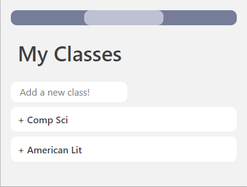

#  Homeroom
*Accessibility. Connectivity. Productivity.*

Built for students and educators of all ages, HomeRoom is the center you need to stay focused when studying or teaching online. As an easy-to-use interactive browser extension, HomeRoom meets all your productivity needs in one simple format - always just a click away. Given its format as an extension, HomeRoom can be used on nearly every device!

## Our Story

### Inspiration
At the beginning of HackThis 2020, our team put together some of the biggest challenges we faced in our online education. During our brainstorming session, we realized that we didn't have to choose which of our major issues to tackle. We knew that the problem we wanted to solve was related to time management, which has become increasingly important due COVID-19's impact on our work and school lives. We came down to four main features that fit the overall theme of time management and productivity. We then put those four major components into a format we don't usually see for productivity apps - a browser extension. Our solution comes in the form of a browser extension because we want such services to be quickly accessible to users rather than embedded in a complex UI (e.g. Trello). We brought our vision to life in HomeRoom, where students and educators alike can use these components in a streamlined manner.

### What We Learned
Our team members definitely learned A LOT during the course of this project, given that majority of our team has never participated in a hackathon before and are incoming college freshmen. HTML, CSS, and Javascript were the key elements to making our vision a reality. When exploring chrome extension deployment, we learned about working with DOM elements. When researching data storage mechanisms, we learned about Chrome Background Store, Firebase, and MongoDB. When designing our UI theme-toggle feature, we learned about CSS custom properties. Through the Web Dev Workshop, some of our members were able to about React and designed a small [homepage](https://shruthikmusukula.github.io/productivity-extension-website/) describing our product. From our SharkTank presentation and customer research (google forms sent out in the HackThis discord server), we developed some marketing skills and were able to share our vision with others. And lastly, we learned to network and build a team (with members from different locations from the US).

### Challenges

## Major Features

### Todo Lists
A staple of every productive student or educator's life is the todo list. HomeRoom's Tasks feature allows you to create multiple lists to subdivide your work into manageable task lists. You can also store links for your reference in this section!

### Class Reminders
To manage your online classes, HomeRoom keeps track of what classes you are taking and when those classes meet. In addition, the extension will allow you to store a recurring video meeting link, and will create a section in the Tasks tab to help you keep track of assignments.

### Pomodoro Timer
Following the principles of the Pomodoro productivity model, the HomeRoom timer will help you stay on track throughout the day. With this timer in the background as you work, you can easily alternate between longer periods of focused work and short breaks to keep yourself refreshed!

        

### Website Blocker 
To further help you stay on track during your periods of work, HomeRoom will block you from a custom list of distracting websites. The extension can prevent you from wasting time by adding the URLs of sites you want to avoid when focusing. 

### Additional Features
In extension options, choose between light mode and dark mode to meet your preference!

     

     

## How to Install
1. Download source files from this repository. 
2. Go to chrome://extensions/.
3. Turn on Developer Mode.
4. Click the "Load Unpacked" button at the top.
5. Select the local folder with downloaded files. 
6. HomeRoom should appear in the Extensions menu in the top right of your browser now!
7. Right-click to pin HomeRoom for quick access.

## Technical Summary
The front end of this software is developed with HTML, CSS, and JavaScript, including JQuery and Bootstrap functions. Data is stored in the Chrome background using browser functions, and will be associated with user Google accounts through an implementation of OAuth. Furthermore, user data will be stored in a MongoDB database, which uses Google Cloud Platform and Python functions.

The code for the extension popup is located in the `popup.html` and `popup.js` files, background functions in `background.js`, and extension options in `options.js` and `options.html`.

## Marketing Presentation
View our team's product demo [here](https://youtu.be/nAbmWyKtlj0)!

## Next Steps
This extension was initially built during the HackThis, HackIllinois Event. While our submission has some incomplete features and glitches, the product currently has some level of functionality for each of our four primary features. We plan to fix all these issues in the coming days and publish this extension to the Chrome App Store, so that students learning from home during the COVID-19 crisis can utilize our app and better focus during distance learning. 

In addition, we will soon add a database backend, integration with Google calendar, and sharing features to build a more immersive experience for our users. HomeRoom will also be expanded to Firefox and other web browsers to reach a wider audience. 

*Contributors: Shruthik M, Kaylin L, Mallika P, Abby M, Mitali C, Muntaser S, Sebastian O*
